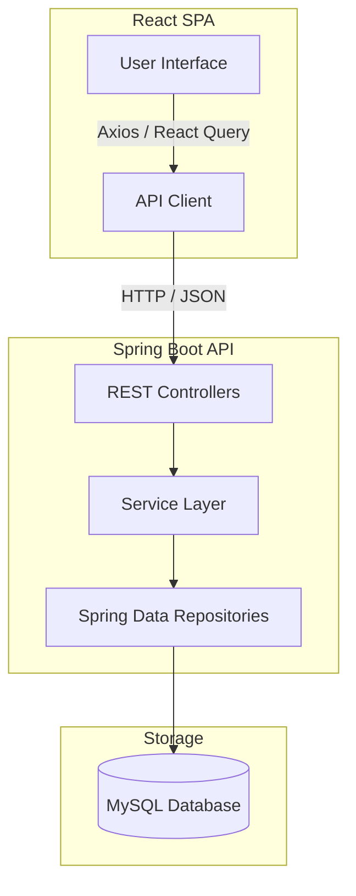

# LMS Assignment & Quiz Management System

A modern, full-featured Learning Management System (LMS) designed for managing student batches, assignments, submissions, and interactive quizzes. The system features a beautiful trainer dashboard, an immersive student portal, and real-time statistics.

---

## 🏗️ Project Architecture

The project is structured as a monorepo consisting of:
1. **Backend**: Spring Boot web application using Spring Data JPA and MySQL.
2. **Frontend**: Modern SPA built with React, Vite, Tailwind CSS v4, Framer Motion, and TanStack Query.



---

## ✨ Features

### 👨‍🏫 Trainer / Manager Portal
- **Dashboard**: Track overall assignment status (Pending, Submitted, Reviewed, Overdue, Late Submitted).
- **Assignment Management**: Create, edit, and delete assignments with description, deadlines, and guidelines.
- **Submission Review**: Grade submissions and provide feedback to students.
- **Gradebook**: Review and manage grades of all students in a clean tabular layout.
- **Interactive Quizzes**: Import quizzes via CSV/XLSX or create them directly, and view attempts.
- **Batch Management**: Create and manage training cohorts/batches (assign courses, instructors, capacity, and students).

### 🎓 Student Portal
- **Dashboard**: Track active assignments, due dates, grades, and completed tasks.
- **My Submissions**: Upload and review files/links for assignments, and see grading feedback.
- **Immersive Quiz Player**: Take quizzes in a focused, distraction-free environment with immediate score calculation.
- **Quiz Results**: View summary of quiz attempts, wrong answers, and performance.

---

## 🛠️ Tech Stack

### Backend
- **Core Framework**: Spring Boot 3.3.1
- **Language**: Java 21
- **Database Access**: Spring Data JPA / Hibernate
- **Database**: MySQL 8.x
- **Build Tool**: Maven

### Frontend
- **Framework / Tooling**: React 19, Vite 8
- **Styling**: Tailwind CSS v4, Lucide Icons, Shadcn Components
- **State & Networking**: TanStack React Query v5, Axios
- **Animations**: Framer Motion
- **Data Visualizations**: Recharts
- **Excel/CSV Parsing**: SheetJS (`xlsx`)

---

## ⚙️ Configuration & Setup

### Prerequisites
- **Java JDK 21**
- **Node.js** (v18 or higher)
- **MySQL Server** (v8.0 or higher)

---

### 1. Database Configuration
1. Make sure your MySQL server is running.
2. Create a database named `lms_xebia`:
   ```sql
   CREATE DATABASE lms_xebia;
   ```
3. Update the database credentials in the backend configurations:
   - File: `backend/src/main/resources/application.properties`
   - Key: `spring.datasource.username` and `spring.datasource.password`

---

### 2. Backend Setup
Navigate to the `backend` directory:
```bash
cd backend
```

**Run in development mode:**
```bash
# Windows
.\mvnw.cmd spring-boot:run

# macOS/Linux
./mvnw spring-boot:run
```

**Build jar file:**
```bash
# Windows
.\mvnw.cmd clean package

# macOS/Linux
./mvnw clean package
```

The server runs on **`http://localhost:8080/api`**.

---

### 3. Frontend Setup
Navigate to the `frontend` directory:
```bash
cd frontend
```

**Install dependencies:**
```bash
npm install
```

**Run development server:**
```bash
npm run dev
```

**Build for production:**
```bash
npm run build
```

The frontend development server runs on **`http://localhost:5173`** (or another port designated by Vite).

---

## 📂 Project Structure

```text
xebia-sub-project/
├── backend/
│   ├── src/main/java/com/lms/backend/
│   │   ├── assignment/      # Assignment controllers, services, repositories
│   │   ├── batch/           # Batch / Cohort management
│   │   ├── course/          # Course entity and API
│   │   ├── quiz/            # Interactive quiz logic and attempt tracking
│   │   ├── student/         # Student profiles and stats
│   │   ├── submission/      # Student submissions and grading
│   │   └── common/          # API Response wrappers and utilities
│   └── pom.xml              # Maven dependencies
├── frontend/
│   ├── src/
│   │   ├── app/             # Application layouts and router config
│   │   ├── features/        # Feature modules (assignments, quizzes, batches)
│   │   ├── shared/          # Shared components and hooks
│   │   ├── lib/             # Utility configurations (axios instance, query client)
│   │   ├── App.jsx          # Routes definition
│   │   └── main.jsx         # App entry point
│   ├── package.json         # Frontend dependencies
│   └── vite.config.js       # Vite configuration
└── README.md                # Project documentation
```

---

## 🔗 Core API Endpoints

All backend endpoints are prefixed with `/api`.

| HTTP Method | Endpoint | Description |
|---|---|---|
| **GET** | `/api/assignments` | Retrieve all assignments (supports `?studentId=` filter) |
| **POST** | `/api/assignments` | Create a new assignment |
| **GET** | `/api/assignments/{id}` | Retrieve details of a specific assignment |
| **PUT** | `/api/assignments/{id}` | Update assignment details |
| **DELETE** | `/api/assignments/{id}` | Delete an assignment |
| **GET** | `/api/submissions` | Retrieve submissions |
| **POST** | `/api/submissions` | Submit work for an assignment |
| **GET** | `/api/quizzes` | Get list of available quizzes |
| **POST** | `/api/quizzes/attempt` | Submit a quiz attempt and calculate score |
| **GET** | `/api/batches` | Get list of all cohorts/batches |
